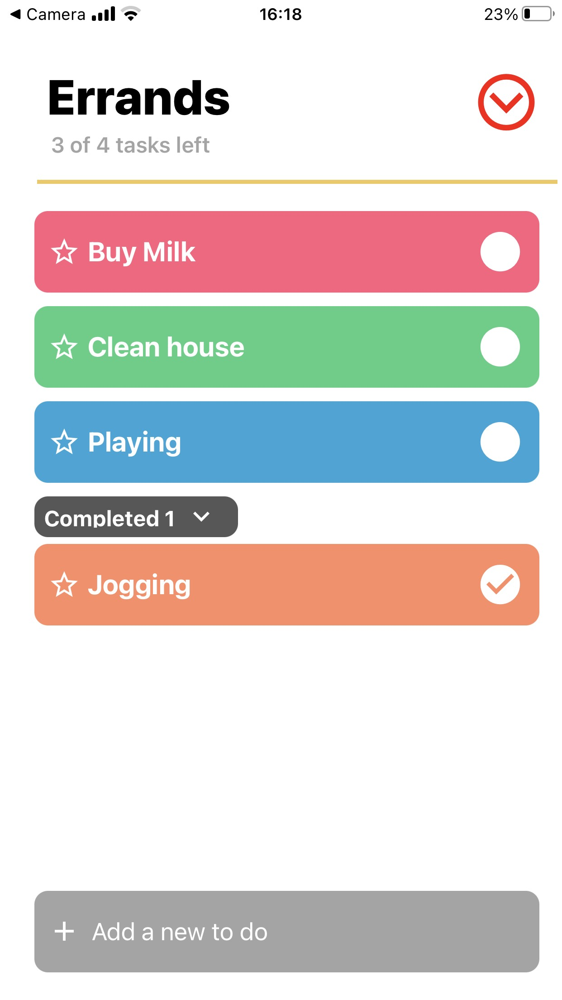
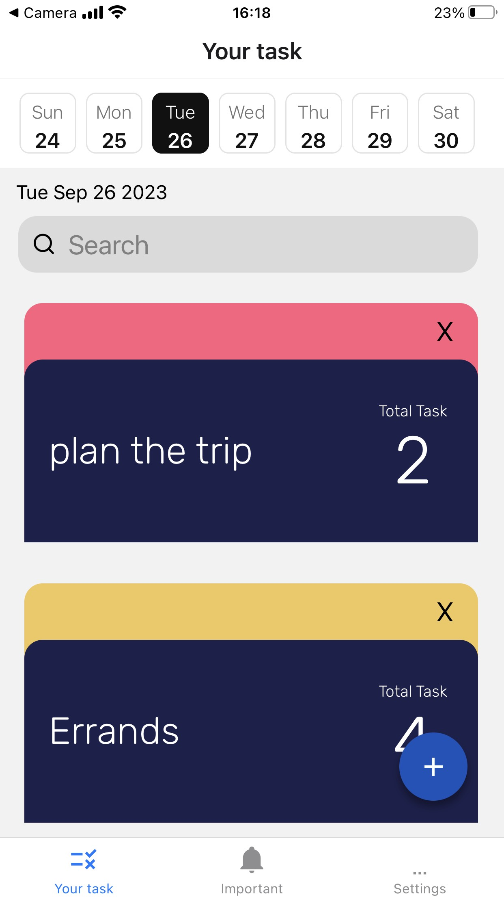

<a name="readme-top"></a>
# TodoList Mobile Application


<!-- ABOUT THE PROJECT -->
### About The Project


### Built With

* 
* 
* 
* 

<p align="right">(<a href="#readme-top">back to top</a>)</p>

### Installation

1. Clone the repo
   ```sh
   git clone https://github.com/sonnguyen1510/TodoList_ReactNative.git
   ```
2. run ``` npm -install ```
3. Install expo app on Appstore for iOS or Google Play for Android
4. run the project with ``` npm start ```
5. scan the QR code in terminal/cmd to deploy project on device (Make sure that your computer and device connect in the similar network )    

<p align="right">(<a href="#readme-top">back to top</a>)</p>

### Preview 


<p align="right">(<a href="#readme-top">back to top</a>)</p>
